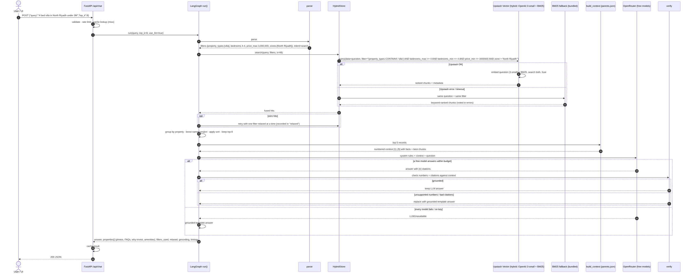
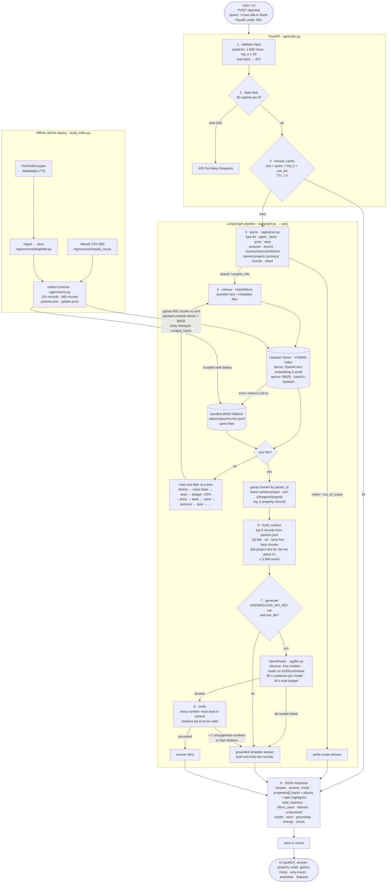
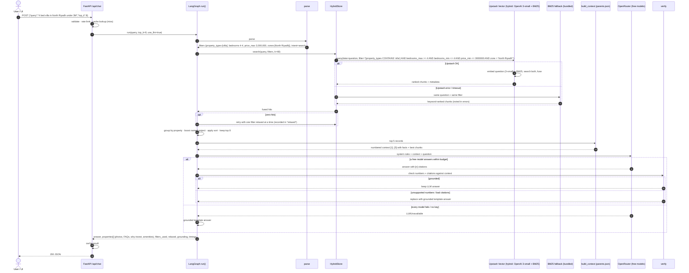

# End-to-end flow of one `/api/chat` request

## Component flow (Mermaid source)

```mermaid
flowchart TD
    U(["User / UI<br/>POST /api/chat<br/>{query: '4 bed villa in North Riyadh under 3M'}"]) --> API

    subgraph API["FastAPI · api/index.py"]
        V["1 · Validate input<br/>pydantic: 1-500 chars, top_k 1-20<br/>bad input → 422"] --> RL{"2 · Rate limit<br/>30 req/min per IP"}
        RL -- over limit --> E429["429 Too Many Requests"]
        RL -- ok --> C{"3 · Answer cache<br/>key = query + top_k + use_llm<br/>TTL 1 h"}
    end
    C -- hit --> OUT
    C -- miss --> P

    subgraph G["LangGraph pipeline · rag/graph.py → run()"]
        P["4 · parse · rag/parser.py<br/>typo fix · types · beds · price · area<br/>purpose · source · country/city/zone/district<br/>named projects (primary) · brands · intent"]
        P -- "intent = out_of_scope" --> OOS["polite scope answer"]
        P -- search / project_info --> R
        R["5 · retrieve · HybridStore<br/>question text + metadata filter"]
        R --> UP[("Upstash Vector · HYBRID index<br/>dense: OpenAI text-embedding-3-small<br/>sparse: BM25 · fused in Upstash")]
        UP -- "error / timeout (20 s)" --> LS[("bundled BM25 fallback<br/>data/corpus/chunks.jsonl<br/>same filter")]
        UP --> RX
        LS --> RX
        RX{"any hits?"} -- no --> RLX["relax one filter at a time<br/>district → exact beds → area → budget +25%<br/>→ price → beds → zone → purpose → type → …"]
        RLX --> R
        RX -- yes --> GR["group chunks by parent_id<br/>boost named project · sort (cheapest/largest)<br/>top_k property records"]
        GR --> BC["6 · build_context<br/>top 5 records from parents.json<br/>[n] title · url · facts line · best chunks<br/>(full project text for 'tell me about X')<br/>≤ 3,500 words"]
        BC --> GEN{"7 · generate<br/>OPENROUTER_API_KEY set<br/>and use_llm?"}
        GEN -- yes --> OR["OpenRouter · rag/llm.py<br/>discover :free models · rotate on 429/5xx/timeout<br/>90 s cooldown per model · 40 s total budget"]
        OR -- "all models failed" --> TPL
        GEN -- no --> TPL["grounded template answer<br/>built only from the records"]
        OR -- answer --> VER["8 · verify<br/>every number must exist in context<br/>citations [n] must be valid"]
        VER -- "> 2 unsupported numbers<br/>or bad citations" --> TPL
        VER -- grounded --> ANS["answer (llm)"]
    end

    OOS --> OUT
    TPL --> OUT
    ANS --> OUT
    OUT["9 · JSON response<br/>answer · answer_mode · properties[] (cards + photos + topic highlights)<br/>total_matches · filters_used · relaxed · understood<br/>model · store · grounding · timings · errors"] --> CW["store in cache"] --> UI(["UI (public/): answer, property cards, gallery,<br/>FAQs · why-invest · amenities · features"])

    subgraph OFF["Offline, before deploy · build_index.py"]
        S1["DarGlobal pages<br/>data/pages (73)"] --> S2["ingest → docs<br/>rag/sources/darglobal.py"]
        S3["Wasalt CSV (80)<br/>rag/sources/wasalt_csv.py"] --> S4
        S2 --> S4["unified schema · rag/schema.py<br/>154 records · 905 chunks<br/>parents.json · golden.jsonl"]
        S4 -- "upload 905 chunks as text<br/>Upstash embeds dense + BM25<br/>(only changed: content_hash)" --> UP
        S4 -- "bundled with deploy" --> LS
    end
```

## One request, step by step

```mermaid
sequenceDiagram
    autonumber
    actor U as User / UI
    participant A as FastAPI /api/chat
    participant G as LangGraph run()
    participant P as parse
    participant S as HybridStore
    participant V as Upstash Vector (hybrid: OpenAI 3-small + BM25)
    participant L as BM25 fallback (bundled)
    participant C as build_context (parents.json)
    participant O as OpenRouter (free models)
    participant Y as verify

    U->>A: POST {"query":"4 bed villa in North Riyadh under 3M","top_k":8}
    A->>A: validate · rate limit · cache lookup (miss)
    A->>G: run(query, top_k=8, use_llm=true)
    G->>P: parse
    P-->>G: filters {property_types:[villa], bedrooms 4-4, price_max 3,000,000, zones:[North Riyadh]}, intent=search
    G->>S: search(query, filters, k=48)
    S->>V: query(data=question, filter="(property_types CONTAINS 'villa') AND bedrooms_max >= 4 AND bedrooms_min <= 4 AND price_min <= 3000000 AND zone = 'North Riyadh'")
    alt Upstash OK
        V->>V: embed question (3-small) + BM25, search both, fuse
        V-->>S: ranked chunks + metadata
    else Upstash error / timeout
        S->>L: same question + same filter
        L-->>S: keyword-ranked chunks (noted in errors)
    end
    S-->>G: fused hits
    opt zero hits
        G->>S: retry with one filter relaxed at a time (recorded in "relaxed")
    end
    G->>G: group by property · boost named project · apply sort · keep top 8
    G->>C: top 5 records
    C-->>G: numbered context [1]..[5] with facts + best chunks
    G->>O: system rules + context + question
    alt a free model answers within budget
        O-->>G: answer with [n] citations
        G->>Y: check numbers + citations against context
        alt grounded
            Y-->>G: keep LLM answer
        else unsupported numbers / bad citations
            Y-->>G: replace with grounded template answer
        end
    else every model fails / no key
        O-->>G: LLMUnavailable
        G->>G: grounded template answer
    end
    G-->>A: answer, properties[] (photos, FAQs, why-invest, amenities), filters_used, relaxed, grounding, timings
    A->>A: cache result
    A-->>U: 200 JSON
```
